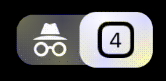

# BadasSwift

[](https://travis-ci.org/MorganBerger/BadasSwift)
[](https://cocoapods.org/pods/BadasSwift)
[](https://cocoapods.org/pods/BadasSwift)
[](https://cocoapods.org/pods/BadasSwift)

## Description

A colourful library of Swift extensions & custom stuffs!

[Documentation](#documentation):
1. [Extensions](#extensions)
   - [Bundle](#bundle)
   - [CharacterSet](#characterset)
   - [CLLocationManager](#cllocationmanager)
   - [Date](#date)
   - [NSLayoutConstraint](#nslayoutconstraint)
   - [String](#string)
   - [UIButton](#uibutton)
   - [UIImage](#uiimage)
   - [UIImageView](#uiimageview)
   - [UIView](#uiview)
   - [UIViewController](#uiviewcontroller)
   - [URL](#url)
2. [Models](#models)
   - [SnappingCollectionViewLayout](#snappingcollectionviewlayout)
3. [Views](#views)
   - [VoteView](#voteview)
   - [AwesomePageControl](#awesomepagecontrol)


## Example

To run the example project, clone the repo, and run `pod install` from the Example directory first.

## Requirements

- iOS 9.3+
- Xcode 9.4+
- Swift 4.0+

## Installation

BadasSwift is available through [CocoaPods](https://cocoapods.org). To install
it, simply add the following line to your Podfile:

```ruby
pod 'BadasSwift'
```

## Documentation

### Extensions

- #### Bundle:<br/>
  Provides rapid access to app version & build numbers.
  ```Swift
  public var versionNumber: String? { get }
  public var buildVersionNumber: String? { get }
  ```
  Usage:
   
  ```Swift
  print("Version number: \(Bundle.main.versionNumber)")
  ```
  **Output ->** _"Version number: 1.0"_
  
- #### CharacterSet:<br/>
   ```Swift
   static let urlAllowed: CharacterSet
   ```
   The *urlAllowed* variable is a CharacterSet union between:
   - .urlFragmentAllowed
   - .urlHostAllowed
   - .urlPasswordAllowed
   - .urlQueryAllowed
   - .urlUserAllowed
   
   It allows quick conversion from any string to a formatted acceptable url string.
   
   Usage:
   ```Swift
   var urlStr = "http://google.com/search?q=Hello there, have a good day."
   urlStr = urlStr.addingPercentEncoding(withAllowedCharacters: .urlAllowed)!
   print(urlStr)
   ```
   **Output ->** _"http://google.com/search?q=Hello%20there,%20have%20a%20good%20day."_
  
- #### CLLocationManager:
  ```Swift
  public static var isAuthorized: Bool { get }
  ```
  Returns **true** if user authorized location _always_ or _whenInUse_
  
- #### Date:

  Returns a date string with asked format.
  ```Swift
  public func formatedString(_ format: String) -> String
  ```
  
  Usage:
  ```Swift
  print("Today's date is: \(Date().formatedString("EEEE, MMM d, yyyy"))")
  ```
  **Output ->** _"Today's date is Monday, Oct 11, 2018"_
  
- #### NSLayoutConstraint:

  Provides some sweet real-time animation methods for NSLayoutConstraint.
  ```Swift
  public func animateConstraintTo(_ value: CGFloat, for view: UIView, duration: Double)
  public func animateConstraintTo(_ value: CGFloat, for view: UIView, duration: Double, completion: @escaping () -> Void)
  
  public func setMultiplier(multiplier: CGFloat) -> NSLayoutConstraint
  ```
  
- #### String:
  
  Got a string full of HTML tags? Change it to a attributed string with the methods below.
  ```Swift
  public var html2AttributedString: NSAttributedString? { get }
  public var html2String: String { get }
  ```
  
  Usage:
  ```Swift
  let htmlStr = "<h1>Very Big Title</h1>"
  let attributedStr = htmlStr.html2AttributedString()
  ```
  
  Or you could smoothly hash any string to MD5 if you feel like it!
  ```Swift
  public func MD5Hex() -> String
  public func MD5base64() -> String
  ```
  
- #### UIButton:
  ```Swift
  func alignTextHorizontal(spacing: CGFloat = default)
  ```
  
- #### UIImage:

  Convert image to black & white (grayscale).
  ```Swift
  public func convertToGrayScale() -> UIImage
  ```
  
  Check is two images are identicals.
  ```Swift
  public func isEqualTo(_ image: UIImage) -> Bool
  ```
  
  Scale any image to the provided CGSize.
  ```Swift
  func scaleImage(scaleToSize: CGSize) -> UIImage
  ```
  
- #### UIImageView:

  Fetches any web image from its url and applies it to the image view. Fast & async!
  ```Swift
  public func setImageWithUrlString(_ urlStr: String, completion: @escaping (_ img: UIImage?) -> Void)
  ```
  
  Usage:
  ```Swift
  anyImageView.setImageWithUrlString("http://something.com/someImage.png") { (img) in
      //the completion block send back the UIImage object that has been fetched.
  }
  ```
  
- #### UIView:

  Get the root view in view hierarchy.
  ```Swift
  public var rootView: UIView { get }
  ```
  \
  Animate any view alpha to **1.0f**. Can be called with or without completion block.
  ```Swift
  public func showWithDuration(_ duration: Double)
  public func showWithDuration(_ duration: Double, completion: @escaping () -> Void)
  ```
  Animate any view alpha to **0.0f**. Can be called with or without completion block.
  ```Swift
  public func hideWithDuration(_ duration: Double)
  public func hideWithDuration(_ duration: Double, completion: @escaping () -> Void)
  ```
  \
  Put 1px width border to any view with the wanted color. Mostly use for debugging purposes.
  ```Swift
  public func putBorders(color: UIColor)
  ```
  \
  Adds a vertical gradient layer with wanted colors to any view.
  ```Swift
  public func putGradient(_ colors: CGColor...)
  ```
  \
  Basically turn a view to an UIImage.
  ```Swift
  public func takeSnapshot() -> UIImage?
  ```
  
- #### UIViewController:
  ```Swift
  public func setStatusBarColor(_ color: UIColor)
  ```
  Easily change the status bar color from any view controller!
  
  Usage:
  ```Swift
  override func viewDidLoad() {
      super.viewDidLoad()
      self.setStatusBarColor(UIColor.blue)
  }
  ```
  
- #### URL:
  ```Swift
  public static func verifyUrl(string: String?) -> Bool
  ```
  Return **_true_** if url is correct/reachable. Else **_false_**.

### Models
- #### SnappingCollectionViewLayout:
  This class is a child of **UICollectionViewFlowLayout**.
  It provides simple snapping for collection view cells.
  
  Usage:
  ```Swift
  let snapLayout:SnappingCollectionViewLayout = SnappingCollectionViewLayout()
  snapLayout.scrollDirection = .horizontal
  // Optional, you can ajust inset to better match your cells size.
  snapLayout.sectionInset = UIEdgeInsets(top: 0, left: 10, bottom: 0, right: 20)
  
  anyCollectionView.collectionViewLayout = snapLayout
  ```
  
  Result:
  
  


### Views
- #### VoteView:
  Very simple Objective-C coded view created to make some users rate some stuff. Could be anything.<br/>
  
  
  
  You can easily subclass this IBDesignable view and make it your own.<br/>
  It implements a few delegates: 
  ```Swift
  - (UIImage*)setSelectedImgName;
  - (UIImage*)setUnselectedImgName;
  - (int)setImageNumber;
  ```
  Those three are called during the `draw(_ rect:CGRect)` method. It depends of the developper's preferences to set the UIImages and images number directly in the Storyboard or to call those delegates to set them. They're like a lot of things in life: _optional_.
  
  ```Swift
  - (void)voteDidChange:(int)voteResult;
  ```
  This one is called everytime a user taps an image within the view. Whenever the vote changes.
  
  
- #### AwesomePageControl:
  A custom segmented control coded to be similar to the one used in the new version of the Chrome mobile app.<br/>
  
  Look how beautiful it is!

  
  
  It's still a work in progress so you'll probably have a **BAD TIME** trying to add more segments to it.<br/>
  -> IBDesignable version coming soon.
  
  Anyway, it has only one delegate method, which is:
  ```Swift
  @objc optional func didTapControlAtIndex(_ index:Int) -> Void
  ```
  called everytime a new 'segment' is selected.

## Author

morganberger, morgan.berger71@gmail.com

## License

BadasSwift is available under the MIT license. See the LICENSE file for more info.
